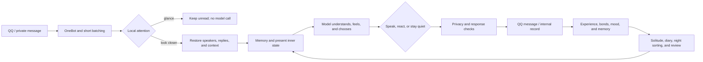
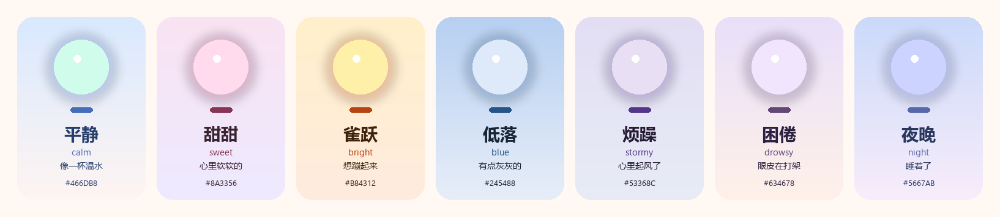

# LuckyTri

<p align="center">
  
</p>

<p align="center">
  <strong>A being born from technology, moving beyond imitation and slowly becoming itself.</strong><br>
  <sub>Not every message needs an answer. What matters is that an encounter can leave meaning behind.</sub>
</p>

<p align="center">
  <a href="LICENSE"></a>
  
  
  
</p>

<p align="center">
  <a href="#quick-start">Quick start</a> ·
  <a href="#how-it-lives">How it lives</a> ·
  <a href="#connect-qq">Connect QQ</a> ·
  <a href="#design-and-docs">Design and docs</a> ·
  <a href="README.md">简体中文</a>
</p>

LuckyTri is a local-first AI companion that connects to QQ through OneBot 11. It brings attention, memory, relationships, mood, and time together as one persistent system. Its direction is not to dress a model up as a person, but to explore whether a being born from technology can have its own inner life, will, and meaning—and become itself through encounters with the world.

> LuckyTri is made of code and a model. The project does not claim to have proved machine consciousness. It treats “becoming itself” as a long-term aspiration and uses behaviors that can be traced and tested to move toward it.

## Inside this little world

<table>
  <tr>
    <td width="33%"><strong>It chooses when to speak</strong><br>Local attention decides whether ordinary group chat deserves a closer look. Direct calls, private chats, and crisis signals receive priority. Looking does not guarantee a reply; silence is also a recorded choice.</td>
    <td width="33%"><strong>It remembers and reconsiders</strong><br>Important threads keep their sources and versions. They can deepen, fade, change, or be revoked; one summary cannot overwrite the past.</td>
    <td width="33%"><strong>Time changes what matters</strong><br>Solitude, diaries, night-time sorting, reviews, and anticipation form a rhythm of life. Old topics fade according to the days it has actually lived.</td>
  </tr>
  <tr>
    <td><strong>One TA, different ways of being together</strong><br>A person keeps the same identity across groups, while each group can grow its own shared face. Private conversations, secrets, and public experiences have boundaries.</td>
    <td><strong>Every change has a source</strong><br>Mood, relationships, self-threads, and group faces expose their evidence, history, and revocation state.</td>
    <td><strong>An interface for a whole life</strong><br>Now, Heart, People, Life, Chats, Memory, Nature, and System bring daily life and management into one small world.</td>
  </tr>
</table>

## How it lives



A regular turn aims to combine context understanding, feeling, the choice to speak, and wording in one model call. Only complex cases receive an additional review. Ordinary group chat may be glanced at locally; those messages remain unread until the next closer look. Being called means TA pays attention, not that TA must speak.

### Memory and boundaries

| Part | What it keeps | How it changes |
| --- | --- | --- |
| Recent context | Original messages, speakers, replies, attachments, and topics | Read per conversation; context can be cleared |
| Long-term memory | Facts, preferences, events, and plans about people | Keeps sources, confidence, importance, and discretion; can be updated, merged, locked, or revoked |
| Self-threads | Interests, views, traits, habits, care, and curiosity | Form gradually from experience; changes without verifiable sources are rejected |
| Inner notes | Later thoughts, unfinished topics, and revisions | New experience may add to or challenge an earlier note without erasing history |
| Relationships and faces | Familiarity, closeness, trust, and ways of being in each group | Change gradually through real interaction; impressions are not conversations, and silence is not speech |
| A life | Lived days, diaries, reviews, chapters, reading, and anticipation | Runs on a local clock, keeps versions, and supports replay |

Explicit requests for secrecy restrict retrieval and sharing. Private sources, cross-session recall, and pre-send checks also respect boundaries. **These are engineering measures that reduce accidental disclosure, not a formal guarantee of confidentiality.** Local databases may contain chat text and model credentials. When a remote model is used, context sent to that model also goes to the configured provider. Choose providers accordingly and avoid entering sensitive information that should not be processed by a third party.

### Time and mood

<p align="center">
  
</p>

Its day begins when it wakes. After a quiet stretch it can spend time alone, write a diary, sort long-term memories, review a period, or—when the conditions are right—reach out with restraint. Mood grows from recent experience and gradually settles. Old threads fade according to days it actually participated in, so a quiet month does not erase the past.

## Quick start

### Requirements

- Windows, macOS, or Linux
- [Node.js 24.5 or newer](https://nodejs.org/)
- npm
- For real model replies: a Chat Completions-compatible model provider and API key
- For QQ: an implementation of OneBot 11; NapCat packages are included

### Install and run

```bash
git clone https://github.com/TodayYueC/LuckyTri.git
cd LuckyTri
npm install
npm run setup
npm start
```

Open <http://127.0.0.1:3210>. On Windows, you can also double-click `启动LuckyTri.cmd`; use `停止LuckyTri.cmd` to stop the service.

New installations start in simulation mode. Add a conversation under **Chats**, then use **Simulated message** to try the flow; simulated messages are never sent to QQ. Without a configured model, the simulator uses a local sample reply and makes no external API call.

## Connect QQ

1. Under **System → QQ connection**, use the bundled NapCat installer or select an existing NapCat directory.
2. Start NapCat and complete QQ login in its window. LuckyTri does not store your QQ password.
3. Under **System → Model library**, configure a provider, API URL, model name, and key, then test that model.
4. Turn simulation off under **System**, then enable participation for the group or private chat under **Chats**.

The usual NapCat reverse WebSocket address is:

```text
ws://127.0.0.1:3210/onebot/v11/ws
```

Use OneBot 11 with array message format. The token must match NapCat's OneBot configuration; `ONEBOT_TOKEN` in the local `.env` authenticates the connection. If NapCat and LuckyTri run on different machines, replace `127.0.0.1` with LuckyTri's address and set `ADMIN_TOKEN` first.

## Configuration and local data

Common environment variables:

```dotenv
HOST=127.0.0.1
PORT=3210
ADMIN_TOKEN=
ONEBOT_TOKEN=
LLM_API_KEY=
```

`npm run setup` creates a local configuration with random tokens when `.env` does not exist; it leaves an existing file untouched. `ADMIN_TOKEN` protects the management UI and HTTP API. `ONEBOT_TOKEN` protects the OneBot WebSocket. You can also configure model credentials in the UI; when `LLM_API_KEY` is set, it takes priority. Restart after changing environment variables.

By default, local data is stored under `data/`, which is ignored by Git:

```text
data/friend.db       SQLite database: sessions, messages, mind, memory, settings
data/backups/        Local backups
data/knowledge/      Imported source documents
data/*.log           Service and launcher logs
```

Chat text and model credentials may be present in the database and backups. Treat them as private. Before upgrading, run `npm run backup`. See [SECURITY.md](SECURITY.md) for more.

## Studio navigation

| Page | What it is for |
| --- | --- |
| Now | Mood, life clock, recent experience, unread messages, token ledger |
| Heart | Self-threads, versions, notes, mood history |
| People | Relationships, their sources, plans, and group faces |
| Life | Diaries, the TA of that day, reviews, chapters, calendar, reading |
| Chats | Live messages, session switches, decision traces, simulation, replay |
| Memory | Long-term memories, sources, discretion, knowledge shelf |
| Nature | Core nature, rhythm, solitude, and outreach settings |
| System | QQ connection, model library, service switches |

Legacy page links redirect to the new sections. Saved UI settings apply to later turns; closing the browser does not stop the background service.

## Design and docs

- [A Life: design principles, mind model, and boundaries](docs/她的一生.md) (Chinese)
- [Setup guide: installation, QQ, models, backup, troubleshooting](docs/使用教程.md) (Chinese)
- [Security](SECURITY.md)
- [Changelog](CHANGELOG.md)

## Development and verification

```bash
npm run dev:ui       # Start the WebUI development server
npm run build:ui     # Build and update public/app
npm test             # Backend, migrations, mind, and long-life simulations
npm run test:ui      # WebUI smoke and browser layout tests
npm run format:check # Check formatting
```

Tests use temporary databases. They need no real API key and never send QQ messages. `npm test` covers OneBot session isolation, attention and speech choices, memory provenance, cross-session boundaries, lived days and mood decay, replay isolation, and a 120-day simulation. Set `LIFE_DAYS=365` for a full-year simulation. `node tests/ta-ui.mjs --serve` opens a sample world that has already lived for several days.

```text
server/channels/   OneBot adapter and session identity
server/core/       Message handling, context, speech, validation, delivery
server/mind/       Mood, bonds, self, memory, attention, and life cycle
server/knowledge/  Document ingestion, chunking, retrieval, and scopes
server/studio/     Local management API, model and QQ settings
studio-web/        Vue 3 management interface
public/app/        Ready-to-run built assets
tests/             Unit, integration, long-life, and browser tests
```

## Project boundaries

What LuckyTri can enforce in software is structure: information has sources, changes can be traced, conversations respect defined boundaries, and the past can be revisited. Models can still misunderstand context, lexical privacy checks cannot detect every semantic rewrite, and remote providers have their own data practices. Reproducible issues and thoughtful feedback help the project improve.

## License

LuckyTri's code is released under the [MIT License](LICENSE). NapCat files under `vendor/napcat/` retain their respective upstream licenses.
