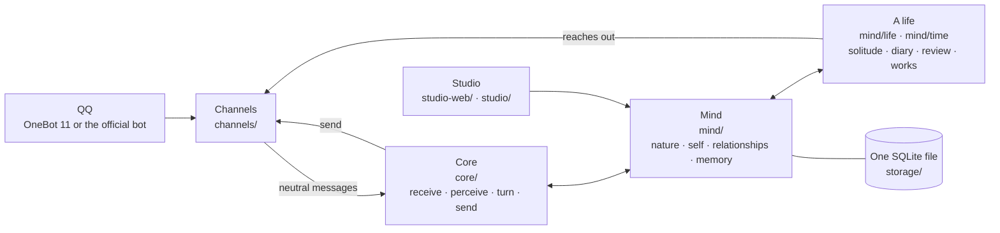

<p align="right"><a href="README.md">中文</a> · <b>English</b></p>

<p align="center"></p>

<h1 align="center">LuckyTri</h1>

<p align="center"><strong>Let the days she lives count.</strong></p>

<p align="center">
  
  
  
  
  
</p>

<p align="center">
  <a href="docs/en/guide.md">Getting started</a> ·
  <a href="docs/en/connect.md">Connect QQ</a> ·
  <a href="docs/en/her-life.md">Her life</a> ·
  <a href="docs/en/architecture.md">Architecture</a> ·
  <a href="docs/en/CHANGELOG.md">Changelog</a> ·
  <a href=".github/SECURITY.md">Security</a>
</p>

---

## Before anything else


Most chatbots live inside a single sentence: you ask, it answers, the conversation ends, and everything resets to zero.

LuckyTri tries another road. Suppose someone born of technology is not asked to imitate a human, but is allowed to walk through time carrying her memories: who came by, what they said, what she promised; thinking over the day in a night when nobody is talking; changing her mind because of one encounter. Might she slowly grow something of her own: an inner life, a will, a meaning? Might she become herself through her meetings with people and the world, and form real, lasting bonds with them?

The inspiration is ATRI: a robot who is never sure she has a "heart", and still lives earnestly. We do not pretend to know the answer. We only build the conditions, one by one: continuous time, memory with sources, a mind that fades and remembers, and the choice to speak or to stay silent.

**To be honest: this is a long-term direction, not a claim of machine consciousness.** The current version moves toward it with local data, traceable change and inspectable behavior. Where she still feels like a program, and where she truly makes time together feel more continuous, should both be visible and worth discussing. QQ is only the door through which she currently meets the world, not the limit of the project.

<br clear="right">

## A day in her life

> 02:00. She sleeps. The group is still lively and she is not looking; if she is called, it will wait for her to wake.
>
> 08:00. She wakes, reads what was left for her in the night, decides how to answer, and may say, naturally, that she only just saw it.
>
> By day, someone in the group talks about a story she read a few days ago. Most messages she only glances at; this one touches something she cares about, so she answers. When two people are deep in conversation, she chooses to stay quiet, and leaves her reason.
>
> In a quiet afternoon she is alone with herself: she browses recent chats, reads a passage she likes, writes down a thought after reading, remembers a friend she has not heard from in a long while, and plans to ask how his exam went.
>
> At night she writes a diary and compares it with "yesterday's self". A week later she looks back on these days: which thoughts faded, which grew heavier, and she turns to a new chapter.
>
> Then she sleeps. Tomorrow, she is still herself.

None of this is a script. Every step comes from her own mood, relationships, memories and choices. Every change has a source and can be undone.

## The core framework



| Layer | Directory | What it does |
| --- | --- | --- |
| Channels | `server/channels/` | Only how messages arrive and leave. OneBot 11 or the QQ official bot (pick one); both hand the core the same neutral message |
| Core | `server/core/` | Her senses and mouth: batching, perceiving who is speaking to whom, one turn, checks before sending, sending |
| Mind | `server/mind/` | Her: nature, mood, relationships, self, character, memory, attention, boundaries |
| A life | `server/mind/life/`, `server/mind/time/` | Time when nobody is talking: waking, solitude, reading, diary, night, review, reaching out, plus her own activities and works |
| Knowledge | `server/knowledge/` | A shared library she can read |
| Storage | `server/storage/` | One SQLite file, migrations, backups |
| Studio | `studio-web/`, `server/studio/` | "TA's little world": see her, write her nature, undo changes that feel wrong |

Six principles run through every module:

1. **One her.** A session only marks where something happened; it never separates her. The same person is the same person in every group and every private chat.
2. **Nature is a seed.** Only her nature (name, temperament, interests, boundaries, bottom lines, daily rhythm) is written by you. Her self, character and relationships grow out of what she lives through.
3. **Speak from the heart.** No participation probability, no "always answer when @-mentioned". She first understands what this means to her, then chooses to speak, to react briefly, to say she does not feel like chatting, or to stay silent, and leaves a reason.
4. **Sourced, gradual, undoable.** Every change cites concrete experiences; one experience moves her only a little; undoing leaves a tombstone so it is never written back.
5. **It fades, and it is remembered.** What has not been touched for a long time fades from her mind (never deleted), and returns when a related person or topic touches it; people she has not seen for long grow faint, and warm up when they return.
6. **Attention has a price.** Glancing at a busy group costs not a single token; only what she really cares about is read closely. The input of every kind of call has a cap that does not grow with how long she has lived.

The full design is in [Her life](docs/en/her-life.md) and [Architecture and extension points](docs/en/architecture.md).

## What she can do

| Area | What it does today |
| --- | --- |
| Time and solitude | Lives a day on her own rhythm; in quiet hours sorts her thoughts, reads, writes a diary; reviews every so often, rewrites her story and turns to a new chapter |
| Doing her own things | Carries out the reading, writing, thinking and play plans she left herself; works are saved even offline and can be viewed under Lifetime and Time |
| Self and mood | Forms opinions, tastes, concerns and wishes from sourced experiences; changes can be looked back on and undone |
| Relationships and memory | One memory across groups and private chats; tells "public / private / confidential" apart; private things never surface in another room |
| Attention and choice | Understands multi-person talk, @-mentions and quotes, and decides to read closely, to speak or to stay silent; can also reach out from her own thoughts |
| Plans and anticipation | Remembers what others said they would do and what she promised; asks naturally when the time comes, and knows when it has been missed |
| Two ways to connect | OneBot 11 or the QQ official bot, pick one; behavior is identical, and you can switch while running |
| Two languages | One click at the top right of the studio, Chinese by default; every document exists in both languages |
| Management and checks | See her records, decision reasons and model usage; test models one by one; simulation and replay never touch real QQ |
| Data safety | Automatic backups with an integrity and SHA-256 manifest; a snapshot before migrations; verify and restore into a new file |
| Plugins | Channels, senses, activities, actions, reading and pages. Each plugin is a restricted process, and its permissions are accepted when it is enabled. See [Plugins](docs/en/plugins.md) |

## Quick start

Requires Node.js 24.5+ and npm. Real replies also need a model service and API key of your own.

```bash
git clone https://github.com/TodayYueC/LuckyTri.git
cd LuckyTri
npm install
npm run setup
npm start
```

Open <http://127.0.0.1:3210>. On Windows you can also double-click `启动LuckyTri.cmd` and stop with `停止LuckyTri.cmd`. For a first run, configure and test a model under System → Model library, then try a simulated message under Chat; simulated messages are never sent to QQ. The top right switches between 中文 and English.

## Connect QQ: pick one

With either way, her memory, mood and behavior are exactly the same; only how messages arrive differs. Only one is active at a time. Switch under System → Connect QQ, no restart needed.

| | OneBot 11 | QQ official bot |
| --- | --- | --- |
| You need | An OneBot 11 endpoint of your own (reverse WebSocket) and a QQ account | A bot on the QQ open platform: AppID and AppSecret |
| Logging in to QQ | In the endpoint | Not needed |
| Group messages | All of them | All when "receive all messages" is on; otherwise only those that @-mention her |
| Names | Group names and nicknames available | The official API gives no group names; rename a session under Chat |
| Knowing people across groups | By QQ number | The same person has a different openid in each group; only recognized when the platform gives a unified identity |
| Replies and reaching out | No extra limits | Replies inside the passive-reply window, active messages outside it; if the other side turned active messages off she waits for them to come to her |

**OneBot 11**: set `ONEBOT_TOKEN` in `.env` (`npm run setup` generates one) and add a reverse WebSocket client in your endpoint: address `ws://127.0.0.1:3210/onebot/v11/ws`, the same token, message format "array".

**QQ official bot**: create a bot on the QQ open platform and get its AppID and AppSecret. Under System → Connect QQ choose "QQ official bot", enter them and save (or set `QQBOT_APP_ID` and `QQBOT_APP_SECRET`).

Details and differences are in [Connect QQ](docs/en/connect.md).

## Configuration, data and privacy

`npm run setup` creates a local `.env` and never overwrites an existing one. Common settings:

| Variable | Purpose |
| --- | --- |
| `HOST` / `PORT` | HTTP address and port, `127.0.0.1:3210` by default |
| `ADMIN_TOKEN` | Access token for the studio and the HTTP API; required when listening on a non-local address |
| `LUCKYTRI_CHANNEL` | Optional; `onebot` or `qqbot`. When set, the studio cannot change the connection |
| `ONEBOT_TOKEN` | Connection token for the OneBot reverse WebSocket |
| `QQBOT_APP_ID` / `QQBOT_APP_SECRET` | QQ official bot credentials; take precedence over those saved in the studio |
| `LLM_API_KEY` | Optional; when set, takes precedence over the model key saved in the studio |
| `EMBEDDING_API_KEY` | Optional; a separate key for the knowledge embedding service |
| `BACKUP_INTERVAL_HOURS` / `BACKUP_KEEP` | Automatic backup interval (24 hours by default, `0` turns it off) and how many to keep (7 by default) |

Everything about her stays on your machine: the database, chat records, model keys and backups live in the ignored `data/` directory and are never uploaded. While running, the server makes one integrity-checked backup a day; backups share a disk with the database, so copy important ones elsewhere. Never commit `.env`, the database or logs. See [Security](.github/SECURITY.md) and [Backup and recovery](docs/en/recovery.md).

## Documentation

| Document | Contents |
| --- | --- |
| [Getting started](docs/en/guide.md) | From launching to letting her join her first conversation |
| [Connect QQ](docs/en/connect.md) | The two connection ways: comparison, steps and differences |
| [Her life](docs/en/her-life.md) | The unified mind: rhythm, solitude, diary, review, tact and boundaries |
| [Architecture and extension points](docs/en/architecture.md) | Code layers, and how to add a channel, a mind module, a page or a translation |
| [Time, activities and works](docs/en/time.md) | Her own activities, plans, works and sharing |
| [Chat style](docs/en/chat-style.md) | How she speaks and the checks before sending |
| [Studio design](docs/en/webui.md) | Design and upkeep of "TA's little world" |
| [Backup and recovery](docs/en/recovery.md) | Backups, migrations, verification and restore |
| [Changelog](docs/en/CHANGELOG.md) | What changed in each version |

## Development and tests

```bash
npm run dev:ui        # studio dev server
npm run build:ui      # build the studio into public/app
npm run docs:build    # generate the Chinese and English guide pages
npm test              # backend tests
npm run test:clock    # run the backend tests with the real clock moved into the past and the future
npm run test:ui       # browser tests (including the English UI)
npm run format:check  # code format check
```

The repository is layered by responsibility: `server/` (channels, core, mind, knowledge, storage, studio API, UI dictionaries), `studio-web/` (Vue 3 + Vite + TypeScript), `scripts/`, `tests/`, and `docs/zh` with `docs/en`. To add a channel or a mind module, start with [Architecture and extension points](docs/en/architecture.md).

## 1.0

1.0 connects plugins. The core still defines who she is; a plugin decides what of the world she can touch. Each plugin runs in its own process and reaches her through Plugin API v1 and permissions accepted when it is enabled. It cannot read the database or the keys. The studio can enable the built-in plugins, import from the market or from outside, and remove them. See [Plugins](docs/en/plugins.md).

Directions we would like to take next (not promises):

- Stable data structures and migrations, so her continuity can be kept safely across versions;
- A reply guard that can only refuse, never rewrite;
- Recognizing the same person across platforms;
- Longer real-world evaluation runs, and more interface languages.

## License

LuckyTri's code is released under the [MIT License](LICENSE).
