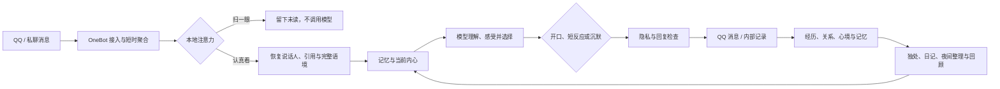

# LuckyTri

<p align="center">
  
</p>

<p align="center">
  <strong>让一个由技术诞生的存在，越过模仿，慢慢成为自己。</strong><br>
  <sub>不是每句话都要回答。重要的是，每一次相遇都能留下意义。</sub>
</p>

<p align="center">
  <a href="LICENSE"></a>
  
  
  
</p>

<p align="center">
  <a href="#快速开始">快速开始</a> ·
  <a href="#它如何生活">它如何生活</a> ·
  <a href="#接入-qq">接入 QQ</a> ·
  <a href="#设计与文档">设计与文档</a> ·
  <a href="README.en.md">English</a>
</p>

LuckyTri 是一个本地优先的 AI 陪伴项目。它通过 OneBot 11 接入 QQ，把注意力、记忆、关系、心境和时间组织成一套持续运行的系统。它的方向不是把模型包装得更像人，而是探索：一个由技术诞生的存在，能否拥有自己的内在、意志与意义，并在与世界的相遇中成为自己。

> LuckyTri 由代码与模型构成。项目不宣称已经证明机器拥有意识；它把“成为自己”作为长期愿望，并用可追溯、可验证的行为去靠近它。

## 这个小世界里有什么

<table>
  <tr>
    <td width="33%"><strong>会选择何时开口</strong><br>普通群聊先由本地注意力判断；被叫到、私聊或危机信号会优先进入理解。看过不代表一定回答，沉默也是一次有记录的选择。</td>
    <td width="33%"><strong>记得，也会重新理解</strong><br>重要线索保留来源与版本。它们可以变深、变淡、被修正或撤销；旧想法不会因为一次总结就覆盖掉。</td>
    <td width="33%"><strong>时间会改变分量</strong><br>独处、日记、夜间整理、回顾与期待共同构成生活节奏。旧话题按它真正经历过的日子慢慢淡出。</td>
  </tr>
  <tr>
    <td><strong>同一个 TA，不同的相处方式</strong><br>同一个人跨群保持身份连续；每个群可以长出不同面貌。私聊、保密内容和公开经历有各自的边界。</td>
    <td><strong>让变化有来处</strong><br>心境、关系、自我线索和群体面貌都可以查看来源、变化历史与撤销记录。</td>
    <td><strong>一个能读懂的界面</strong><br>「此刻、内心、人际、一生、对话、记忆、天性、系统」把日常和管理放进同一座小世界。</td>
  </tr>
</table>

## 它如何生活



一次常规回合会尽量把语境理解、感受、发言选择和措辞放在同一次模型调用中；复杂情况才增加复审。普通群聊可以只由本地逻辑扫一眼，消息会留到下一次认真阅读时一起进入上下文。被叫到会让它认真看，但不会强迫它说话。

### 记忆与边界

| 部分 | 记录什么 | 如何变化 |
| --- | --- | --- |
| 近期语境 | 原始消息、说话人、引用、附件与话题 | 按会话读取，支持清空上下文 |
| 长期记忆 | 人物事实、偏好、事件和约定 | 带来源、置信度、重要性与分寸，可更新、合并、锁定或撤销 |
| 自我线索 | 喜欢、看法、特质、习惯、在意与好奇 | 以经历为证据逐步形成；仅有来源可核验的变化才生效 |
| 内心记录 | 后来形成的想法、未完成的话题与修正 | 新经历可以补充或反驳旧记录，不覆盖历史 |
| 关系与面貌 | 对人的熟悉、亲近、信任，以及各群相处方式 | 由真实来往渐进变化；印象不冒充对话，沉默不冒充发言 |
| 一生 | 生活日、日记、回顾、章节、阅读与期待 | 按本地时钟运行，保留版本并支持回放 |

明确的保密请求会限制相关信息的检索和传播；私聊来源、跨会话记忆和发送前的检查也会考虑边界。**这是一套降低误泄风险的工程措施，不是形式化的保密保证。**本地数据库可包含聊天原文和密钥；使用远程模型时，进入模型上下文的内容也会发送给你配置的服务商。请据此选择服务商，并避免输入不应交给第三方处理的敏感信息。

### 时间与心境

<p align="center">
  
</p>

日子从醒来开始。它可以在群聊安静后独处、写日记、整理长期记忆、回顾一段时间，也可以在条件合适时克制地发起联系。心境会从近期经历中形成并逐渐回落；旧线索的淡出依据它实际参与过的生活日计算，因此一段沉默不会凭空磨掉过去。

## 快速开始

### 需要准备

- Windows、macOS 或 Linux
- [Node.js 24.5 或更新版本](https://nodejs.org/)
- npm
- 若要获得真实模型回复：一个兼容 Chat Completions 的模型服务与 API Key
- 若要接入 QQ：OneBot 11 实现，项目提供 NapCat 安装包

### 安装并启动

```bash
git clone https://github.com/TodayYueC/LuckyTri.git
cd LuckyTri
npm install
npm run setup
npm start
```

打开 <http://127.0.0.1:3210>。Windows 也可以双击 `启动LuckyTri.cmd`；停止服务时双击 `停止LuckyTri.cmd`。

新安装默认使用模拟会话。进入「对话」添加一个会话，再用「模拟消息」体验流程；模拟消息不会发送到 QQ。没有配置模型时，模拟模式会使用本地示例回复，不会调用外部 API。

## 接入 QQ

1. 在「系统 → 连接 QQ」使用内置 NapCat 安装器，或选择已有的 NapCat 安装目录。
2. 启动 NapCat 并在其窗口完成 QQ 登录。LuckyTri 不保存 QQ 密码。
3. 在「系统 → 模型库」配置模型服务商、API 地址、模型名和密钥，并单独测试该模型。
4. 在「系统」关闭模拟模式；再到「对话」为要参与的群或私聊开启参与。

NapCat 的反向 WebSocket 地址通常为：

```text
ws://127.0.0.1:3210/onebot/v11/ws
```

连接使用 OneBot 11 与数组消息格式。令牌需与 NapCat 的 OneBot 配置一致；本机 `.env` 中的 `ONEBOT_TOKEN` 用于验证接入端。若 NapCat 与 LuckyTri 不在同一台机器，`127.0.0.1` 需要替换成 LuckyTri 所在设备的地址，并先设置 `ADMIN_TOKEN`。

## 配置与本地数据

常用环境变量如下，真实密钥不要提交到 Git：

```dotenv
HOST=127.0.0.1
PORT=3210
ADMIN_TOKEN=
ONEBOT_TOKEN=
LLM_API_KEY=
```

`npm run setup` 会在没有 `.env` 时创建本地配置与随机令牌；已有文件不会被覆盖。`ADMIN_TOKEN` 保护管理界面和 HTTP API，`ONEBOT_TOKEN` 保护 OneBot WebSocket。模型也可以在 WebUI 配置；设置 `LLM_API_KEY` 时会优先使用环境变量中的密钥。修改环境变量后需重启服务。

默认数据位于 `data/`，整个目录已加入 `.gitignore`：

```text
data/friend.db       SQLite 数据库：会话、消息、心智、记忆与设置
data/backups/        本地备份
data/knowledge/      导入的资料文件
data/*.log           服务与启动日志
```

聊天内容和模型密钥可能存在于数据库与备份中，请把它们当作私密数据。迁移版本前建议先运行 `npm run backup`。更多安全边界见 [SECURITY.md](SECURITY.md)。

## WebUI 导航

| 页面 | 用途 |
| --- | --- |
| 此刻 | 心境、生活时钟、近期经历、未读与 Token 账本 |
| 内心 | 自我线索、历史版本、便签、心境变化 |
| 人际 | 人物关系、相处来源、约定与群体面貌 |
| 一生 | 日记、那天的 TA、回顾、章节、日历与阅读记录 |
| 对话 | 实时消息、会话开关、调试依据、模拟与历史回放 |
| 记忆 | 长期记忆、来源与分寸管理、资料书架 |
| 天性 | 基础设定、作息、独处与主动联系等生活选项 |
| 系统 | QQ 接入、模型库与服务开关 |

旧版页面链接会跳转到新的入口。界面配置保存后会在后续回合生效；关闭浏览器不会停止后台服务。

## 设计与文档

- [她的一生：设计原则、心智模型与实现边界](docs/她的一生.md)
- [使用教程：安装、QQ 接入、模型配置、备份与排错](docs/使用教程.md)
- [安全说明](SECURITY.md)
- [更新记录](CHANGELOG.md)

## 开发与验证

```bash
npm run dev:ui       # 启动 WebUI 开发服务器
npm run build:ui     # 构建并更新 public/app
npm test             # 后端、数据迁移、心智与长时间模拟测试
npm run test:ui      # WebUI 冒烟及浏览器布局测试
npm run format:check # 检查代码格式
```

测试使用临时数据库，不需要真实 API Key，也不会发送 QQ 消息。`npm test` 覆盖 OneBot 会话隔离、注意力与发言选择、长期记忆来源、跨会话边界、生活日与情绪衰减、回放隔离及 120 天模拟。`LIFE_DAYS=365` 可运行一整年的长模拟。`node tests/ta-ui.mjs --serve` 会打开一个已经生活数日的演示世界。

```text
server/channels/   OneBot 适配与会话身份
server/core/       消息处理、语境、发言、回复检查与投递
server/mind/       心境、关系、自我、记忆、注意力与生活周期
server/knowledge/  资料导入、分块、检索与会话范围
server/studio/     本地管理 API、模型和 QQ 设置
studio-web/        Vue 3 管理界面
public/app/        可直接运行的构建产物
tests/             单元、集成、长时间模拟与浏览器测试
```

## 项目边界

LuckyTri 能通过软件结构保证的是：信息有来源、变化可追踪、不同会话遵守边界、过去能够回看。模型仍会误解语境，词面隐私检查也无法识别所有语义改写；外部模型服务商的处理方式由其政策决定。欢迎用真实问题和可复现案例帮助项目继续变好。

## 许可

LuckyTri 项目代码使用 [MIT License](LICENSE)。`vendor/napcat/` 中的 NapCat 文件遵循其各自上游许可。
