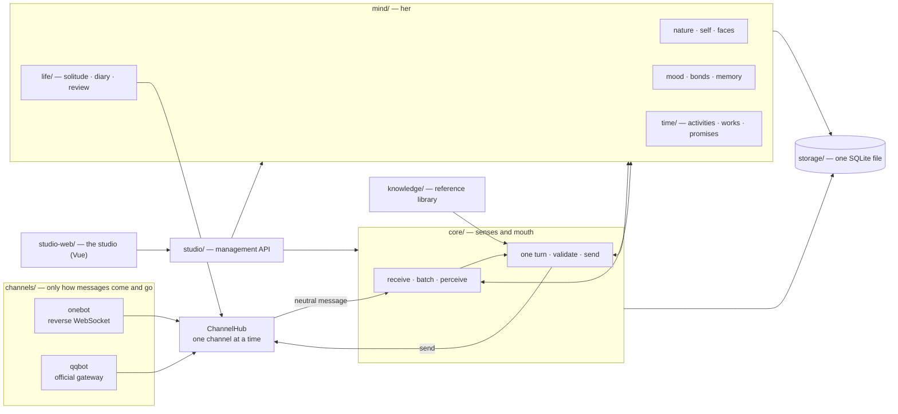

<p align="right"><a href="../zh/architecture.md">中文</a> · <b>English</b></p>

# Architecture and extension points

This document is for anyone who wants to read, change or extend LuckyTri. It answers three questions: how the code is layered, how a message travels through her life, and where to start when you want to add something.

## One picture



Nothing above the channel knows which platform a message came from. The core sees one kind of neutral message, and she reads herself from one shared mind.

## Directories

```text
server/
  index.js app.js http.js   composition root, Express shell, HTTP helpers
  version.js                the single source of the version (reads package.json)
  channels/                 the connection layer: hub, contract, session keys, onebot/, qqbot/
  core/                     the conversation pipeline: receive, batch, perceive, turn, validate, send,
                            plus model management, feedback, group voice and model presets
  mind/                     her: nature, mood, bonds, self, faces, memory, attention, bottom lines…
    life/                   lifetime: waking, solitude, diary, night, review, reaching out
    time/                   time: activities, to-dos, works, experiences, sharing, standalone search
  knowledge/                reference library: chunking, retrieval, vector index
  storage/                  SQLite store, schema version and migration, backups and auto-backups
  studio/                   management API: settings, display names, readiness checks
  i18n/                     English dictionaries for server-visible text (translated at the API exit only)
studio-web/src/             the studio: Vue 3 + Vite + TypeScript
  pages/                    one folder per entry
  components/  stores/  mood/  i18n/  styles/
scripts/                    setup, launch, start-server, stop, backup, recover, build-guide
scripts/dev/                evaluation and audit: evaluate-*, audit-sent, test-clock
tests/                      *.test.js backend tests · ui/ browser tests · helpers/ deterministic world
docs/                       zh/ and en/ mirrored documents · brand/ images
public/                     the built studio (app/) and the guide pages
```

## The life of a message

1. **The channel receives.** The adapter turns the platform's raw event into a neutral message: session key, sender, time, whether she was @-ed, the quoted message, attachments. The platform's format exists only inside the adapter.
2. **Batching and perception** (`core/`). Messages arriving close together form a batch; @s, quote chains and name calls are parsed, giving each message its relation to her.
3. **Attention** (`mind/attention.js`, no model call). Being called, a private chat and crisis signals always get a close look; ordinary group chat is decided by a deterministic score between a close look and a glance.
4. **The her of this moment** (`mind/view.js`). Nature, threads of self, bonds, mood, memory and nearby promises are condensed into a few hundred tokens with a hard cap: the stable part goes into a cacheable prefix, the changing part at the end.
5. **One turn call.** The model returns, in one go: what this means to her, a feeling, changes to people, a choice (speak, react briefly, say she does not feel like talking, stay silent), a reason and the wording.
6. **Experience.** Whether she speaks or not, feelings and changes are written into the mind, each citing its source.
7. **Validation and sending.** Local checks on tone and secrecy, one review or rewrite when needed, a safe short line if it still fails; the context is checked for staleness again before sending. Uncertain delivery is never resent.
8. **Lifetime.** When nobody is talking, time still passes through her: solitude, reading, the diary, night sorting, review and reaching out all read and write the same mind.

Replay runs the same pipeline but only reads the mind as it was before that moment; trial chat reads her mind as it is now but writes nothing and sends nothing to QQ.

## Invariants

These are the promises the code and the tests guard together; make sure they still hold when you change something.

- **One her**: a session only marks where something happened, it does not wall off her self.
- **Sourced, gradual, undoable**: mind tables are append-only; each change cites a specific experience; an undo leaves a tombstone and is never written back.
- **Fading is computed at read time**: no "faded" flag is stored, so replay only reads the past; fading counts the days she lived through, not calendar days.
- **Discretion follows the source**: what was learned privately or told in confidence never appears in another room.
- **The clock is injectable**: the test world has its own clock; any code quietly reading the real clock shows up under `npm run test:clock`.
- **Her words are not translated**: interface text can be localized; what she says, her diary, thoughts and reasons are her own content and stay as written.
- **One database holds the data**: SQLite under `data/` in WAL mode; the schema version is kept in `PRAGMA user_version` and migrations are idempotent.

## Extension points

### Connecting a plugin

A plugin does not edit the core. It runs in its own process and uses Plugin API v1: a channel registers on `ChannelHub`, a sense lands in `inner.senses`, an experience is stored in `mind_observations`, an activity kind joins `server/mind/time/kinds.js`, an action joins `server/core/capabilities.js`, and attachment perception joins `server/core/perceivers.js`. The host lives in `server/plugins/`. See [Plugins](plugins.md).

### Adding a channel

1. Create a folder under `server/channels/` that fulfils the contract in `contract.js` (`type`, `capabilities`, `attach`, `start`, `stop`, `send`, `fetchQuoted`, `fetchImage`, `refreshDirectory`, `canReach`, `status`, `close`), wrapped with `defineChannel`.
2. Turn platform events into neutral messages: the adapter fills in `platformId`, `accountId`, `time`, `mentions`, `replyId` and `attachments` itself.
3. Register the adapter in `adapters.js` (so the core knows what that platform's media links look like), add one factory line in `createChannels` in `index.js`, and build session keys with `formatSessionKey`.
4. Write a test against a fake platform in `tests/` and let the same scenarios in `channel-contract.test.js` run through it.

Nothing above the core changes. The connection option in settings and the readiness checks each need a small section per channel.

### Adding a mind module

1. Add tables in `server/mind/schema.js` (append, never overwrite); bump `DATABASE_VERSION` in `server/storage/archive.js` when needed and keep the migration idempotent.
2. Write the module in `server/mind/` and wire it into `Mind` through `server/mind/index.js`; changes must cite sources and support undo.
3. To reach her "now", read it in `view.js` and respect the length cap.
4. To show it in the interface, add an endpoint in `server/mind/api.js`.
5. Write tests with the deterministic world in `tests/helpers/world.js`, always using the world's clock for time.

### Adding a studio page

1. Write the page in `studio-web/src/pages/<name>/`, register the entry and navigation in `router.ts`, and mount the component in the `loaders` map of `pages.ts` under the page name.
2. Wrap every string with `t()`, `N_()` or `localized()`; the Chinese original is the key.
3. Add English in `studio-web/src/i18n/en/`; missing English falls back to Chinese and `tests/i18n-web.test.js` will tell you.
4. Use the localized helpers in `format.ts` for dates and numbers.

### Adding or changing translations

- Interface text: `studio-web/src/i18n/en/*.ts`, one file per area.
- Server-visible text (errors, readiness checks, labels, model preset notes): the dictionaries in `server/i18n/`, with `{0}` variable patterns.
- Documents: `docs/zh/` and `docs/en/` have matching file names; when you change one side, update the other.
- `tests/i18n-server.test.js`, `tests/i18n-web.test.js` and `tests/ui/i18n.mjs` check the dictionaries, the interface and a whole English page respectively.

## Test layout

| Command | What it covers |
| --- | --- |
| `npm test` | All backend tests, including the deterministic "life simulation" |
| `npm run test:clock` | The suite run with the real clock moved 60 days back and 400 days ahead |
| `npm run test:ui` | Browser tests: smoke, the little world, navigation, time, performance, search, English interface |
| `npm run format:check` | Prettier check |
| `tests/repo-hygiene.test.js` | Repository hygiene: no keys, instance data, local paths or third-party connector names |

## Conventions

- Change the version only in `package.json`; the server reads it through `server/version.js`.
- The built studio is committed in `public/app/`; run `npm run build:ui` after changing the frontend.
- The guide pages are generated by `npm run docs:build` from `docs/zh/guide.md` and `docs/en/guide.md`.
- Runtime data, backups, reports and secrets stay on the machine and never enter the repository.
