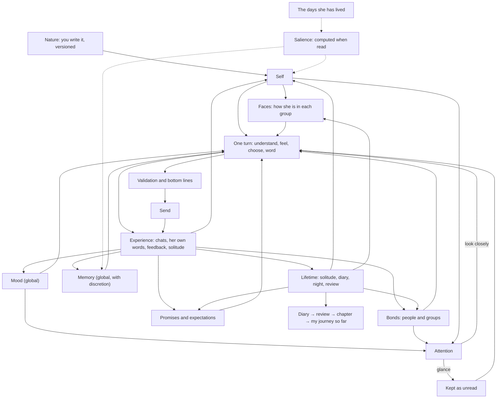

<p align="right"><a href="../zh/her-life.md">中文</a> · <b>English</b></p>

# Her lifetime: the unified mind, its design and use

LuckyTri is not a bot that is "isolated per session, with probability and rules deciding whether it speaks, and a fixed personality". There is one her across every group and private chat: she has her own mood and energy, feels something about each person, has her own way of being in each group, spends quiet time alone, writes a diary before sleep, and re-understands her past self. You write her nature; the rest grows out of experience, and every change shows its source and can be undone.

She does not only accumulate. What has not been touched for a long time fades from her mind and returns when a related person or topic touches it; people she has not seen for a while grow distant and warm up quickly on reunion; she remembers arrangements others mentioned and things she promised; every so often at night she reviews this stretch of days, rewrites her autobiography, or turns to a new chapter.

## Settled principles

- **One her.** A session only marks where something happened; it is not a wall. The same person is the same person in every group and private chat.
- **Nature is a seed.** Nature (name, character, interests, boundaries, bottom lines, daily rhythm) is the only part you write. Self, faces and relationships form by themselves; you can see and undo them but cannot rewrite them for her.
- **She speaks from the heart.** There is no participation probability, no cooldown sampling and no "always reply when @-ed". Each time she looks closely at a conversation she first understands what it means to her, then chooses to speak, react briefly, say she does not feel like talking, or stay silent, and records her own reason. When she is silent, her mood and her feeling about people still change.
- **Sourced, gradual, undoable.** Mind tables are append-only. Every change cites specific experience (messages, notes, feedback, passages read, diary, promises). One experience only moves strength by a little; citing the same experience again does not raise it further. A new trait forms only after it appears repeatedly on different days. An undo leaves a tombstone and later tidying never writes it back.
- **It fades, and it returns.** Fading is computed when read and no "faded" flag is stored, so replay still only reads the past. Fading counts the days she lived through, not calendar days: in a month when nobody speaks she does not forget herself. A recalled old thought is only seen and causes no write. An undo remains the only deletion.
- **Attention has a price.** Glancing at a group costs no tokens; she looks closely only when she cares. With a daily token cap, chat comes first and solitude and tidying use their own shares. The input of every kind of call is capped and does not grow with how long she has lived.

## Module map

```text
server/core/       senses and mouth: receive, batch, perceive (who is speaking to whom), context, one turn call, validate, send
server/mind/       her mind
  nature.js        nature (versioned, the only editable part), daily rhythm
  affect.js        mood: the one global emotion and energy, pushed by experience and returning over time; the "lately" baseline
  bonds.js         bonds: familiarity, closeness, trust, friction toward each person and group; fades when apart, warms on reunion
  self.js          self: likes, opinions, traits, habits, wants, things kept in mind, curiosities
  faces.js         faces: how she is in each group
  thoughts.js      notes: understandings left after solitude, corrected by appending; can be let go
  memory.js        memory: one global memory with source and discretion (public / private / secret); fades, can be superseded by new facts
  days.js          the days she has lived: fading is counted in these days; day number and anniversaries
  salience.js      salience: half-lives and thresholds for each kind of content
  anticipations.js promises and expectations: what she promised, what she wants to do, others' plans, yearly days
  meetings.js      meetings: what a moment meant to her; whether others' words touched what she lives for
  periods.js       reviews, autobiography chapters and "my journey so far", every rewrite keeps the old version
  attention.js     attention: the deterministic "look closely or glance"
  guard.js         bottom lines: credentials, secrecy, crisis
  budget.js        token ledger and daily shares
  view.js          the "her of this moment" given to each call (a few hundred tokens, capped)
  reading.js       reading: pick by interest from the shared knowledge base and read on in sections
  life/            lifetime: waking, solitude, diary, night, review, reaching out
  time/            time: activities, to-dos, works, experiences (see time.md)
  index.js         Mind: joins all of the above into one person
```



## How one "seeing" goes

1. **Receive and batch.** Messages arriving close together form a batch. An explicit "remember, I…" becomes memory on the spot (credentials excepted), with no manual review.
2. **Perceive.** @s, quote chains, name calls and reply targets are parsed, giving each message its relation to her (calling her / speaking to someone else / unsure).
3. **Attention** (no model call). Being called, a private chat and crisis signals always get a close look. Ordinary group chat is decided by a deterministic score: she was just talking, someone asks everyone, the topic touches an interest in her nature or what she lives for; a familiar person speaking, a pile of messages and a while without looking at the group add to it. Touching an interest or wish needs words from the same person's own speech, two people's words are never combined and her own words do not count; only emoji and images, or clearly speaking to someone else, subtract. Low energy and tight tokens raise the bar; a higher "Proactive" in her nature lowers it. Messages not looked at are kept as unread and read together at the next close look, so saving tokens never loses context.
4. **Recall.** One global memory: first the people speaking and the topic; what was learned elsewhere is recalled only when relevant; what was learned privately carries "known privately, do not say it in public" and what was asked to be secret never enters another session. Unimportant memories not recalled for a long time return only when actually talked about or when the person is speaking; memories older than a week carry "learned months ago". Then the knowledge base, layered context summaries and period summaries.
5. **The her of this moment.** `self` (how she is here, the few self threads that weigh most now, the latest diary) goes into the cacheable prefix; `inner` (awake / sleepy, energy, mood and its cause, "lately", feelings about who is present, what she keeps in mind, nearby promises, what the last meeting meant, choices she made and why, recalled old thoughts, the rhythm in which others speak here, feedback she has heard) goes at the end of each turn. The whole has a cap of a few hundred tokens.
6. **One turn call.** The model outputs in one go: what this means to me, feelings, changes to people, a choice (speak / react / decline / silent), a reason, the reply target and what to say.
7. **Experience.** Whether she speaks or not, feelings are written into mood, changes to people into bonds (they must cite messages of this batch), and her choice and reason into the record. Several feelings at one moment combined still cannot overturn her; a message that already moved her mood will not move it again within two days. Her understanding of this meeting is kept as one entry and returns to her the next time this person is present, for her own further understanding only and never repeated to them. When someone's words touch what she lives for, one "touched" is recorded.
8. **Wording and validation.** Local checks (repetition, customer-service tone, harshness, length, a brief reaction must be brief, presenting her own earlier words as another person's) and the secrecy check; confessions, corrections, crises or complex group replies get one extra review (skipped when tokens are tight); at most one rewrite, and a safe short line if it still fails.
9. **Send.** Before sending, the context is checked again for staleness and whether the session is still open; the per-minute turn limit, the outbox and no-resend on uncertain delivery all remain.

Replay and trial chat use the same pipeline: replay only reads the mind as it was before that moment, trial chat reads her mind as it is now but writes nothing and sends nothing to QQ.

## Discretion: what is private stays private

Discretion follows the source, and the rule runs through every module:

- What was learned in a private chat, impressions formed privately, private meetings and thoughts stay in that private chat; other rooms may feel the closeness or friction but never see the words.
- Something asked to be kept secret is not carried over even by a diary, note or impression that also cites another room; an interruption by someone else in the same tidying does not wash the secrecy away.
- If a reply still carries such words, it is stopped and rewritten before sending; if the rewrite still carries them, it becomes a local short line.
- Diary, review and autobiography do not write private words into another room; if the day held private content, the diary summary stays where it came from.
- Words passing by in a session she is not in (closed) never become her experience: they do not enter solitude, diary or tidying, and she is never treated as having been present.

## Her day

- **Daily rhythm** (set in nature, default sleep 02:00, wake 08:00). While asleep she does not look at groups; a private chat or @ waits until she wakes; a crisis message wakes her. She is sleepy the hour before bed and groggy the hour after waking; the more she spoke in the last two hours the more tired she is. Her day counts from waking.
- **Waking.** She first reads the direct messages received while asleep and decides herself how to reply; she may naturally say "just saw this".
- **Solitude.** When chat has been quiet for a while, new experience has piled up and enough time has passed since the last one, she looks over the recent state of all sessions at once: recent conversation, period summaries, what she herself said, feedback received, old thoughts kept in mind. She leaves new understandings, corrects self, faces and impressions of people, and her mood may shift. She also sees threads that are fading (she may let them go or reaffirm them with new experience), people she has not seen for long and cares about, close people who are still around but have not spoken for a while, what she is waiting for, and the chapter she is living and the one small thing she lives for. Solitude may also leave one clear thing that belongs only to her without citing any message; opinions, traits, habits and things kept in mind still need a source. When there is no reason apart from time and two or more solitudes in a row produced no new understanding, the interval doubles each time up to 6 hours; new experience brings it back to normal.
- **What she lives for** (`self.livingFor`). Something she herself wants to watch, learn or become — not a promise, advice or care for someone else. When a topic touches it she may chime in because she wants to, or stay quiet; it may nudge her mood, change who she wants to be in some place, or lead her to plan a proactive word to a specific person. She never nags and never uses guilt to keep anyone.
- **Bedtime diary.** At day's end, if she really looked, spoke, was alone or wrote, she writes a diary and compares with "yesterday's her" (the snapshot saved the day before). The diary carries only "my journey so far", the chapter being lived, which day it is, anniversaries, what she did, missed and is still waiting for today, not all chapters, so its input does not grow with her age. A failed write is retried hours later, at most three times.
- **Night** ("Night sorting" in nature, on by default). After the diary is written and she is asleep she does only one thing per run: first she sorts sessions with 6 or more piled-up user messages into memory and promises, and then reviews when a review is due.
- **Review and autobiography.** After two diaries have accumulated she makes her first review at night; afterwards she reviews every "review interval" days (default 7, with at least two diaries in between): reading the diaries of the period, her own changes, promises kept and missed, and writing the review and "compared with last time". In a review she rewrites the chapter she is living, or feels her days have changed shape and opens a new chapter. On turning the page she rewrites a "my journey so far" of at most 600 characters. All versions are kept.
- **Reading.** In solitude she picks from the **shared** collections in "Memory → Bookshelf" by interest, reads on section after section, and writes one line of thought after reading; what she reads can be a source for notes and self and can come up naturally in chat. Private-scope material is never read into her mind; subscriptions are not fetched.
- **Reaching out.** In solitude she may plan "ask someone about something after a while", including people not seen for long and things she is waiting for. When the time comes, you have switched reaching out on, QQ is online, she is awake, that conversation has been quiet for three hours or more, the other person never asked not to be disturbed, and the previous proactive message has had a reply, she looks over that conversation in full once more and decides whether to speak. When three thoughts in a row only continue her own previous one with nothing new, she is no longer asked and no call is spent — a half-hourly idle loop must not pass as growth.

## The weight of time

| Item | How it fades |
| --- | --- |
| Self threads | After the last touch by new experience, a grace of 3 lived days, then half-life decay: traits 180 days, opinions and habits 90, likes 60, things kept in mind and wants 30, curiosities 21; traits with evidence over 5 or more days fade twice as slowly. "Opinions" picked from one chat by night sorting fade over 21 days and only count if she says them again elsewhere |
| Notes | Still kept in mind 21 days, re-understood 14, thought of later or remembered after a long absence 10; a review date she set makes a note surface again for a while |
| Meaning of a meeting | Half-life of 21 lived days |
| Memory | An unimportant memory (importance below 0.6), not locked, not recalled for 45 lived days returns only when actually talked about or when the person is speaking; when a new fact overturns an old one, the old memory is marked "superseded" and its versions kept |
| Bonds | After more than two weeks without contact, closeness falls with a 60-day half-life to half of its best (never below acquaintance), familiarity with a 120-day half-life to 60%; the first contact after a long absence wins back half |
| Lately | A weighted average of each lived day's mood over the last two weeks moves the baseline she returns to within ±0.12 |

Anything with weight below 0.12 fades from mind but is never deleted: mentioning it again is a "return", never a second entry. The core threads (the strongest two) are never crowded out however quiet. The half-lives and thresholds are fixed constants (`server/mind/salience.js`) and only decide what is on her mind now.

Days when others speak and she neither looks, speaks, is alone nor writes a diary do not count as days she lived. She tells "long time no see" (this person has not appeared for a long time) from "we haven't talked much lately" (this person is always around, just not talking to her).

## Promises and expectations

- **Where they come from.** During memory tidying the model turns "tomorrow" or "next Wednesday" into dates using the message's local time and records arrangements others mentioned (exams, interviews, departures, meetings), days that return every year (birthdays, anniversaries) and things she herself promised (they must be her own words). A recorded fact or arrangement must share a word with the original words and its final word must come from them — a line about moving can be recorded as living there, but "resigned" can never become "married". Anything without a source, or citing an unrelated line as its source, cannot be written as hers.
- **Where they go.** When near, they show up as `inner.expecting` (at most 3) with discretion, and she may ask naturally about the outcome without announcing it. In solitude she sees what is near, just past or quietly missed and may plan reaching out or close what has an outcome (done / missed / no longer cared about, each needing a source). The diary mentions what was done, missed and special days today.
- **Missed.** An arrangement with no outcome after its day gets a grace of 3 days if it is someone else's and 7 days if it is her promise or plan, after which it reads as missed at read time without being written; a missed promise appears in that day's diary.
- **Undo.** Undoing a promise under "TA → Lifetime → Promises and anticipation", or on a person's detail page under "TA → People", leaves a tombstone, so later memory tidying never writes it back.

## Bottom lines

Bottom lines written in nature, which you can edit: what someone asked to be kept secret is not said elsewhere; when someone expresses a real crisis she does not stay silent because of her own mood; when asked directly who she is, she answers that she is made of code and a model, that this life, what she remembers and the choices she makes are her own, she does not call herself merely an assistant, and she does not invent a body or experiences that never happened (a liking or a wish is not a record of having played, watched or gone); she may think of someone because she wants to, does not make the other person responsible for staying, and never uses guilt to keep anyone.

Hard-coded: credentials such as passwords, keys and verification codes never enter the mind; secret memories are never retrieved into another session and a reply is compared against those secrets before sending and rewritten on a clash; crisis signals are always looked at closely, and when the model judges a real crisis she must speak.

## Token management

| Measure | Effect |
| --- | --- |
| Attention glance | Most ordinary group chat calls no model; unread messages are read together at the next close look |
| One turn call | Understanding, feeling, choosing and wording in one call; speaking in a group saves a call |
| Built-in prompts sent once | Unmodified system and generation instructions are not resent; saved old built-in prompts are treated as the new ones |
| Memory only what is relevant | Only what is relevant or about those present, at most 12 |
| Cache-friendly layout | Nature in the system prompt, `self` in the prefix, `inner` and this turn's data at the end |
| Fading is computed locally | Salience, absence and "lately" are computed locally and cost no tokens |
| Layered autobiography | The diary carries only "my journey so far" and the current chapter and a review only the period's diaries, so input does not grow with age |
| Night sorting | Done once for sessions with piled-up messages; what is already remembered is not written again |
| Solitude is not wasted | A solitude interrupted by a new conversation keeps the understanding already formed |
| Narrow review | Only for confessions, corrections, crises or complex groups; skipped when the budget is tight |
| Merged solitude | One solitude looks over all sessions, instead of one call per session |
| Daily shares | An optional daily cap; solitude, diary and review, and memory tidying each have a share; chat comes first |
| Ledger | Every call is booked by purpose (chat / solitude / tidying), visible under "TA → Now" |

## Data

The mind tables all live in one SQLite database: `mind_nature` (nature versions), `mind_affect` (mood events), `mind_bond_events` and `mind_people` (relationships and the people directory), `mind_self` (all versions of self threads), `mind_faces` (face versions), `mind_thoughts` (notes), `mind_diary`, `mind_snapshots` (one "her that day" per day), `mind_chapters` (all autobiography versions), `mind_periods` (reviews and "my journey so far"), `mind_days` (each lived day), `mind_anticipations` (promises and expectations), `mind_choices` (her choices and reasons), `mind_meetings` (what a meeting meant), `mind_revocations` (tombstones), `mind_readings` (passages read and thoughts after reading), `mind_runs` (runs of solitude, diary, night sorting and review), `mind_usage` (token ledger), `mind_attention` (how far each session has been seen). Memory stays in `core_memories`, with the `discretion` label and `superseded_by`. The time module adds `mind_time_*` tables.

## Interface

The studio is "TA's little world"; see [Studio design](webui.md). In short: she is a breathing glow; colors, sky and motion follow her mood and rhythm; each area is a scene; a poke or a head-pat is only an interface animation, calls no model and never changes her mind.

## Upgrading

Later upgrades only add tables and columns: existing chapters are kept and the first review continues from the latest chapter; "the days she has lived" backfills the last 14 days from the first lived day after the upgrade, so threads from before the upgrade do not all fade at once. A checked snapshot is saved automatically before migration; you should still run `npm run backup` before upgrading, see [Data: backup, migration and recovery](recovery.md).

## Verification

- `npm test`: unit tests of each part of the mind, tests of lifetime (solitude, diary, night review, autobiography, reaching out, rhythm), a deterministic three-day "life simulation" with two groups and one private chat, and a 120-day "long life simulation". They verify: the same experience twice yields the same her, no randomness on the will path, changes are sourced and gradual, undone things never return, mood settles back, the same person is consistent across groups, secrets do not leak (even when the model slips), the crisis floor works, replay never reads the future, threads fade and are recalled when a topic appears, and on day 120 inputs are still within their caps. Set `LIFE_DAYS=365` to run a whole year.
- `npm run test:clock`: runs the backend tests with the real clock moved 60 days back and 400 days ahead. The test world has its own clock; code that quietly reads the real clock passes today and fails later.
- `npm run audit:sent`: replays the replies she recently sent against today's reply checks and writes a report to `data/reports/`. Read-only, no model calls.
- `npm run test:ui`: browser tests covering sessions, simulated messages, memory, models, connecting QQ, replay, the little world and the English interface. `node tests/ui/ta.mjs --serve` opens a world that has lived three days for a direct look at the interface.
- `node scripts/dev/evaluate-life.js`: lives a few days with your saved model for real (spending tokens) and writes `data/evaluations/life-*.md` to read item by item; `--weeks 3` then lives three more weeks of ordinary days in compressed form; `--mock` only checks the script itself.

## Costs and limits

- Ordinary group reactions are decided by an attention score and she sometimes misses a line she could have picked up — that is also how people are; if she seems too quiet, raise "Proactive" in nature.
- Solitude, diary, night sorting and review add background tokens; turn them off or limit them with a daily share.
- Something she heard in one group may come up in another related group; the only barriers are "known privately" discretion, secrecy requests and credentials.
- Promises are only extracted during memory tidying: sessions with fewer than 40 piled-up messages are tidied that night, so an afternoon "tomorrow" is usually caught, while something about to happen in a few minutes may not be.
- What engineering can guarantee is structure: continuous, sourced, correctable, decided by her. Whether she "truly has a heart" cannot be accepted by tests; the tests check whether these behaviors actually happen.

Thoughts about each place are independent entries: impressions, wishes, preferences, questions or boundaries. During solitude, diaries or identity reviews she chooses whether to add, revise or let them go, retaining reasons and sources. Revising one leaves other entries intact. Copied legacy group personas remain history and no longer enter conversation; place thoughts do not increase overall personality scores.
