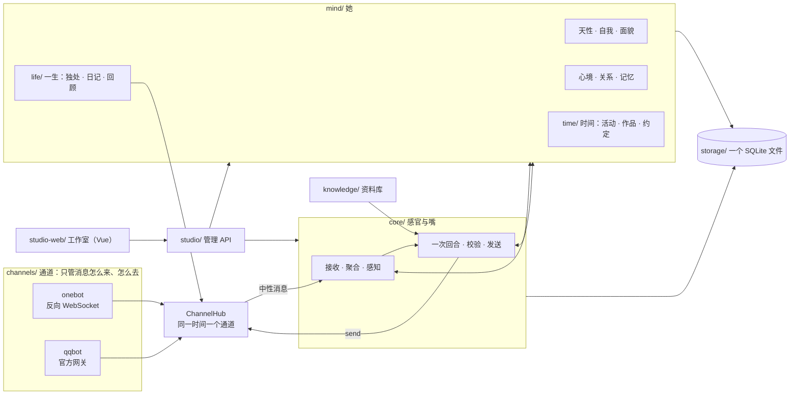

<p align="right"><b>中文</b> · <a href="../en/architecture.md">English</a></p>

# 架构与扩展点

这份文档写给想读懂、修改或扩展 LuckyTri 的人。它回答三件事：代码怎样分层、一条消息怎样走完一生、想加东西时从哪里下手。

## 一张图



通道之上没有任何一处知道「这条消息来自哪个平台」。核心看到的是同一种中性消息，她从同一份心智里读取自己。

## 目录

```text
server/
  index.js app.js http.js   组合根、Express 外壳、HTTP 辅助
  version.js                唯一的版本号来源（读 package.json）
  channels/                 接入层：hub、契约、会话键、onebot/、qqbot/
  core/                     对话链路：接收、聚合、感知、回合、校验、发送，
                            以及模型管理、反馈、群体语气、模型预设
  mind/                     她：天性、心境、关系、自我、面貌、记忆、注意力、底线……
    life/                   一生：醒来、独处、日记、夜里、回顾、主动联系
    time/                   时间：活动、待办、作品、体验、分享、独立搜索
  knowledge/                资料库：分段、检索、向量索引
  storage/                  SQLite 存储、结构版本与迁移、备份与自动备份
  studio/                   管理 API：设置、显示名、就绪检查
  i18n/                     服务端界面文案的英文词典（只在 API 出口处翻译）
studio-web/src/             Vue 3 + Vite + TypeScript 的工作室
  pages/                    每个入口一个目录
  components/  stores/  mood/  i18n/  styles/
scripts/                    setup、launch、start-server、stop、backup、recover、build-guide
scripts/dev/                评测与审计：evaluate-*、audit-sent、test-clock
tests/                      *.test.js 后端测试 · ui/ 浏览器测试 · helpers/ 确定性世界
docs/                       zh/ 与 en/ 一一对应的文档 · brand/ 图片
public/                     构建后的工作室（app/）与教程页
```

## 一条消息的一生

1. **通道接收**。适配器把平台的原始事件转成中性消息：会话键、发送者、时间、是否 @、被引用的消息、附件。平台的格式只存在于适配器里。
2. **聚合与感知**（`core/`）。短时间内的连续消息合成一批；解析 @、引用链、点名，得到每条消息与她的关系。
3. **注意力**（`mind/attention.js`，不调用模型）。被叫到、私聊、危机信号一定细看；普通群聊按确定性的分数决定细看还是扫一眼。
4. **此刻的她**（`mind/view.js`）。把天性、自我线索、关系、心境、记忆、临近的约定整理成有上限的几百 Token：稳定的部分放进可缓存前缀，变化的部分放在末尾。
5. **一次回合调用**。模型一次给出：这对她意味着什么、感受、对人的变化、选择（开口、简短反应、说不想聊、不出声）、理由和措辞。
6. **经历**。无论说不说，感受与变化都写入心智，且都引用来源。
7. **校验与发送**。本地校验语气与保密，必要时复审或重写一次，仍不合格就改用安全短句；发送前再检查语境是否过期。投递结果不确定时不重发。
8. **一生**。没人说话时，时间仍然经过她：独处、阅读、写日记、夜里整理、回顾、主动联系，都读写同一份心智。

回放走同一条链路，但只读取当时之前的心智；试聊读取她此刻的心智，但不写入、不发 QQ。

## 不变量

这些是代码与测试共同守护的约定，改动时请先确认它们仍然成立。

- **一个她**：会话只标记事情发生在哪里，不隔开她的自我。
- **系统是一体的**：她感知得到自己的状态，包括接上了什么、插件开着还是关着。工作室里看到的和她知道的是同一份状态。
- **有来源、渐进、可撤销**：心智表只追加；每条变化引用具体经历；撤销留下墓碑，之后不会被写回。
- **淡出是读时计算的**：不写「已淡出」标记，回放因此只读过去；淡出按她经历过的日子算，不按日历。
- **分寸跟着来源走**：私下知道的、被要求保密的，不会在别的房间出现。
- **时钟可注入**：测试世界有自己的时钟；任何悄悄读取真实时钟的代码会在 `npm run test:clock` 里暴露。
- **她的话不翻译**：界面文案可以本地化；她说的话、日记、念头和理由是她自己的内容，保持原文。
- **数据只在一个库里**：`data/` 下的 SQLite，使用 WAL；结构版本用 `PRAGMA user_version` 标记，迁移幂等。

## 扩展点

### 接上一个插件

插件不改核心代码。它跑在自己的进程里，通过 Plugin API v1 使用下面这些扩展点：通道注册到 `ChannelHub`，感官进入 `inner.senses`，经历写入 `mind_observations`，活动类型进入 `server/mind/time/kinds.js`，行动进入 `server/core/capabilities.js`，附件感知进入 `server/core/perceivers.js`。宿主在 `server/plugins/`。说明见 [插件](plugins.md)。

### 新增一个通道

1. 在 `server/channels/` 下新建目录，实现 `contract.js` 里的契约（`type`、`capabilities`、`attach`、`start`、`stop`、`send`、`fetchQuoted`、`fetchImage`、`refreshDirectory`、`canReach`、`status`、`close`），用 `defineChannel` 包起来。
2. 把平台事件转成中性消息：`platformId`、`accountId`、`time`、`mentions`、`replyId`、`attachments` 由适配器直接填好。
3. 在 `adapters.js` 注册适配器（让核心知道这个平台的媒体链接长什么样），在 `index.js` 的 `createChannels` 里加一行工厂，会话键用 `formatSessionKey` 生成。
4. 在 `tests/` 里用假平台写一个测试，并让 `channel-contract.test.js` 的同一套场景也跑一遍。

核心以上不需要改。设置页的连接方式选项与就绪检查按通道各写一小段。

### 新增一个心智模块

1. 在 `server/mind/schema.js` 里加表（只追加，不覆盖），需要时递增 `server/storage/archive.js` 里的 `DATABASE_VERSION` 并保持迁移幂等。
2. 在 `server/mind/` 里写模块，通过 `server/mind/index.js` 接入 `Mind`；变化必须引用来源，支持撤销。
3. 要进入她的「此刻」就在 `view.js` 里取用，并控制长度上限。
4. 要在界面看到就在 `server/mind/api.js` 里加接口。
5. 用 `tests/helpers/world.js` 的确定性世界写测试，时间一律用世界的时钟。

### 新增一个工作室页面

1. 在 `studio-web/src/pages/<名字>/` 里写页面，在 `router.ts` 注册入口与导航，在 `pages.ts` 的 `loaders` 里按页面名挂上组件。
2. 所有文案用 `t()`、`N_()` 或 `localized()` 包起来，中文原文就是键。
3. 在 `studio-web/src/i18n/en/` 里补英文；缺少的英文会回退成中文，`tests/i18n-web.test.js` 会提醒。
4. 日期和数字用 `format.ts` 里的本地化函数。

### 补充或修改翻译

- 界面文案：`studio-web/src/i18n/en/*.ts`，按区域分文件。
- 服务端可见文案（错误、就绪检查、标签、模型预设说明）：`server/i18n/` 里的词典，支持 `{0}` 变量模式。
- 文档：`docs/zh/` 与 `docs/en/` 文件名一一对应；改一边请同步另一边。
- `tests/i18n-server.test.js`、`tests/i18n-web.test.js` 与 `tests/ui/i18n.mjs` 分别检查词典、界面与整页英文。

## 测试布局

| 命令 | 内容 |
| --- | --- |
| `npm test` | 后端全部测试，含确定性的「一生模拟」 |
| `npm run test:clock` | 把真实时钟拨到 60 天前和 400 天后各跑一遍 |
| `npm run test:ui` | 浏览器测试：冒烟、小世界、导航、时间、性能、搜索、英文界面 |
| `npm run format:check` | Prettier 检查 |
| `tests/repo-hygiene.test.js` | 仓库卫生：不含密钥、实例数据、本机路径和第三方接入端名称 |

## 约定

- 版本号只改 `package.json`；服务端通过 `server/version.js` 读取。
- 构建后的工作室提交在 `public/app/`，改动前端后运行 `npm run build:ui`。
- 教程页由 `npm run docs:build` 从 `docs/zh/guide.md` 与 `docs/en/guide.md` 生成。
- 运行时数据、备份、报告和密钥永远只在本机，不进入仓库。
