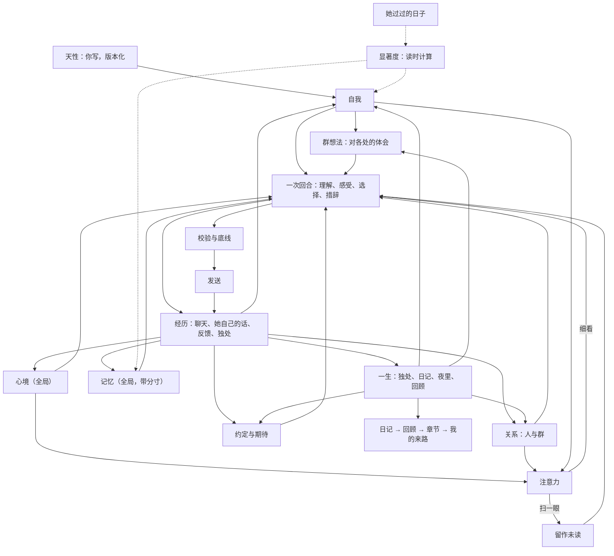

<p align="right"><b>中文</b> · <a href="../en/her-life.md">English</a></p>

# 她的一生：统一心智的设计与使用

LuckyTri 不是「按会话隔离、由概率和规则决定开不开口、人格固定不变」的机器人。所有群聊和私聊里只有一个她：她有自己的心情和精力，对每个人有感觉，在每个群有自己的样子，会在安静时独处、在睡前写日记，会重新理解过去的自己。你写下她的天性；其余的部分从经历里长出来，每一次变化都能看到来源，也都能撤销。

她不只会积累。很久没被触及的东西会从心上淡去，被相关的人或话题碰到时又会想起；久别的人会变淡，重逢时很快热络；她记得别人说过的安排和自己答应的事；每隔一段时间，她会在夜里回顾这段日子，改写自传，或者翻开新的一章。

## 已定原则

- **一个她**。会话只是「事情发生在哪里」的标注，不是隔离墙。同一个人在所有群和私聊里是同一个人。
- **天性是种子**。天性（名字、性格、兴趣、边界、底线、作息）是唯一由你编写的部分。自我、面貌、关系由她自己形成；你能看、能撤销，但不能替她改写。
- **由心开口**。没有参与概率、冷却抽样和「被 @ 必回」。每次细看一段对话，她都先理解这对她意味着什么，再选择说、简短反应、说不想聊或不出声，并留下自己的理由。沉默时她的心情和对人的感觉照样会变。
- **有来源、渐进、可撤销**。心智表只追加不覆盖。每条变化都引用具体经历（消息、手记、反馈、读过的段落、日记、约定）。一次经历只让强度小幅变化；同一段经历再引用一次，强度不再升高。新的特质要在不同的日子里反复出现才成形。撤销留下墓碑，之后的整理不会把它写回来。
- **会淡去，也会想起**。淡出是读的时候算出来的，不写任何「已淡出」标记，所以回放仍然只读过去。淡出按她经历过的日子计算，不按日历：没人说话的一个月里，她不会把自己忘掉。被勾起的旧念头只是被看见，不产生写入。撤销仍是唯一的删除。
- **注意力有代价**。扫一眼群聊不花 Token；只有真的在意时才细看。一天的 Token 有上限时，对话优先，独处和整理用各自的份额。每一类调用的输入都有上限，不随她活得多久而增长。

## 模块地图

```text
server/core/       感官与嘴：接收、聚合、感知（谁在对谁说）、语境、一次回合调用、校验、发送
server/mind/       她的心智
  nature.js        天性（版本化，唯一可编辑）、作息
  affect.js        心境：唯一的全局情绪与精力，由经历推动、随时间回落；「这阵子」的基线
  bonds.js         关系：对每个人、每个群的熟悉、亲近、信任、别扭；久别变淡、重逢回暖
  self.js          自我：喜欢、看法、特质、习惯、想做的事、放在心上的事、好奇
  faces.js         面貌：她在每个群的样子
  thoughts.js      手记：独处后留下的理解，修正时追加；可以放下
  memory.js        记忆：一份全局记忆，带来源与分寸（公开 / 私下 / 保密）；会淡出，可被新事实取代
  days.js          她过过的日子：淡出按这些日子计算；第几天与纪念日
  salience.js      显著度：各类内容的半衰期与阈值
  anticipations.js 约定与期待：她答应的事、她想做的事、别人的安排、每年的日子
  meetings.js      相遇：这件事对她意味着什么；别人的话有没有碰到她正在为自己而活的事
  periods.js       回顾、自传章节与「我的来路」，每次重写都保留旧版本
  attention.js     注意力：确定性的「细看还是扫一眼」
  guard.js         底线：凭据、保密、危机
  budget.js        Token 账本与每日份额
  view.js          给每次调用的「此刻的她」（有上限的几百 Token）
  reading.js       阅读：按兴趣从共享知识库分段读下去
  life/            一生：醒来、独处、日记、夜里、回顾、主动联系
  time/            时间：活动、待办、作品、体验（见 time.md）
  index.js         Mind：把上面这些连成一个人
```



## 一次「看见」的流程

1. **接收与聚合**。短时间内的连续消息合成一批。明确的「记住，我……」当场成为记忆（凭据除外），不再等待人工审核。
2. **感知**。解析 @、引用链、点名和回复对象，得到每条消息与她的关系（叫她 / 在和别人说 / 不确定）。
3. **注意力**（不调用模型）。被叫到、私聊、危机信号一定细看。普通群聊按确定性的分数决定：刚才她还在聊、有人问大家、聊到她天性里的兴趣、聊到她正在为自己而活的事；熟悉的人在说话、攒了不少消息、有一阵没看群，也会加分。碰到兴趣或愿望要对上同一个人自己的话里的词，两个人的话不能拼在一起，她自己说过的话也不算；只有表情和图片、明显在和别人说话会减分。精力低、Token 紧张时门槛变高；天性里的「主动」越高门槛越低。没细看的消息保留为未读，下一次细看时一起读到，所以不会因为省 Token 丢掉上下文。
4. **回忆**。一份全局记忆：先看当前说话的人和话题，别处知道的事只在相关时想起；私聊里知道的带上「私下知道，不要当众说出口」，被要求保密的绝不进入别的会话。很久没被想起、又不太重要的记忆，只在被真正聊到或本人在说话时才回来；超过一周的记忆带上「几个月前知道的」。再加上知识库、分层语境摘要和阶段总结。
5. **此刻的她**。`self`（她在这里的样子、此刻最有分量的几条自我线索、最近一篇日记）放进可缓存的前缀；`inner`（醒着 / 犯困、精力、心情和原因、「这阵子」、对在场的人的感觉、放在心上的事、临近的约定、上次相遇的意义、她做过的选择和理由、被勾起的旧念头、这个地方别人说话的节奏、最近听到的反馈）放在每轮末尾。整体有几百 Token 的上限。
6. **一次回合调用**。模型一次输出：这对我意味着什么、感受、对人的变化、选择（speak / react / decline / silent）、理由、回复目标和要说的话。
7. **经历**。无论说不说，感受写入心境，对人的变化写入关系（必须引用这批里的消息），她的选择和理由写入记录。同一时刻的几种感受合在一起仍然不能把她推翻；已经推动过心情的消息，两天之内不会再推一次。她对这次相遇的理解留下一条，下次这个人在场时回到她眼前，只供她自己接着理解，不复述给对方。别人的话碰到她正在为自己而活的事，记一次「被碰到」。
8. **措辞与校验**。本地校验（重复、客服腔、刻薄、字数、简短反应要短、把自己先说的话说成别人说的）和保密检查；倾诉、纠正、危机或复杂的群聊回复额外复审一次（Token 紧张时跳过）；最多重写一次，仍不合格就用安全短句。
9. **发送**。发送前再检查语境是否过期、会话是否仍开启；每分钟发言轮数限制、发件箱、不确定投递不重发都保留。

回放和试聊走同一条链路：回放只读取当时之前的心智，试聊读取她此刻的心智但不写入、不发 QQ。

## 分寸：私下的就留在私下

分寸跟着来源走，这条规则贯穿所有模块：

- 私聊里知道的事、私下形成的印象、私下的相遇和念头，只留在那个私聊；别的房间最多感到亲近或别扭，看不到那句话。
- 被要求保密的事，哪怕引用它的日记、手记、印象还引用了别的房间，也不会被带过去；同一次整理里别人插话，也不会把保密冲掉。
- 回复里如果还是带上了这些话，发出去之前会被拦下重写；重写仍带着，就改成一句本地短句。
- 日记、回顾、自传不把私下的原话写进别的房间；那天如果有私下的内容，日记摘要也留在原处。
- 她不在的会话（已关闭）里路过的话，不会变成她的经历：不进独处、日记和整理，也不会因此当成她当时在场。

## 她的一天

- **作息**（天性里设置，默认 02:00 睡、08:00 醒）。睡着时不看群；被私聊或 @ 会等醒来再看；危机消息会叫醒她。睡前一小时犯困、刚醒一小时迷糊；两小时内说话越多越累。她的一天从醒来算起。
- **醒来**。先读睡着时收到的直接消息，自己决定怎么回，可以自然地说「刚看到」。
- **独处**。聊天安静一阵、积累了新的经历、距离上次足够久时，她会一次看完所有会话的近况：最近的对话、阶段总结、她自己说过的话、收到的反馈、放在心上的旧想法。留下新的理解，修正自我、面貌和对人的印象，心情也会变。她还会看到正在淡出的线索（可以放下，或在有新经历时重新确认）、好久没见又挺在意的人、人还在眼前但有一阵没说上话的亲近的人、她在等的事，以及自己正在经历的这一章和正在为自己而活的那一件小事。独处也可以留下一件说得清、只属于自己的小事，不必引用某条消息；看法、特质、习惯和放在心上的事仍然要有来源。除了时间没有别的理由、又连着两次以上没有新的理解时，间隔逐次加倍，最长 6 小时；有新经历就照常。
- **正在为自己而活的那一件**（`self.livingFor`）。她自己想看、想学、想成为的事，不是对别人的承诺、建议或照看。话题碰到它时她可以因为自己想而接一句，也可以不出声；它可以让心情变一点、改她在某个地方想成为的样子，也可以据此对具体的人计划一句主动的话。不催人，不靠愧疚留人。
- **睡前日记**。一天结束时，如果她真的看过、说过、独处或写过，她会写日记，并和「昨天的她」（前一天保存的快照）对照。日记只带上「我的来路」、正在经历的这一章、今天是第几天、纪念日、今天做到的、错过的和仍在等的事，不带所有章节，所以输入不随她的年龄增长。写失败会隔几个小时再试，最多三次。
- **夜里**（天性页「夜里整理」，默认开启）。日记写完、她睡着以后，每次只做一件事：先把积压了 6 条以上用户消息的会话整理进记忆和约定，然后在回顾到期时回顾。
- **回顾与自传**。日记攒到两篇以后，她会在夜里第一次回顾；之后每隔「回顾间隔」天（默认 7 天，期间至少两篇日记）回顾一次：读这段时间的日记、自己的变化、做到和错过的约定，写下回顾和「和上次比」。回顾时她会改写正在经历的这一章，或觉得日子换了样子、翻开新的一章。翻篇时重写一段不超过 600 字的「我的来路」。所有版本都保留。
- **阅读**。独处时，她会从「记忆 → 资料书架」里的**共享**集合按兴趣挑着读，读完一段接着读下一段，写下一句读后的想法；读到的内容可以成为手记和自我的来源，聊天时可以自然提起。私聊范围的资料不会被她读进心里；订阅源不抓取。
- **主动联系**。独处时她可以计划「过一阵想问问某人某件事」，包括好久没见的人和她在等的事。时间到了、你打开了主动联系、QQ 在线、她醒着、那段对话已经安静三小时以上、对方没说过别打扰、上一次主动的话已经有回应时，她会再完整看一次那段对话，自己决定说不说。连着三条念头都只是在接自己上一条、没有新东西时，不再问她，也不花调用——半小时一次的空转不能冒充成长。

## 时间的重量

| 对象 | 怎么淡 |
| --- | --- |
| 自我线索 | 最后一次被新经历触及后宽限 3 个有经历的日子，再按半衰期淡去：特质 180 天、看法与习惯 90 天、喜欢 60 天、放在心上与想做的事 30 天、好奇 21 天；证据跨 5 天以上的特质再慢一倍。夜里整理从一次聊天里挑出的「看法」按 21 天淡去，之后在别处又被她说到才算数 |
| 手记 | 仍放在心上 21 天、重新理解 14 天、后来想到与久别想起 10 天；约好的回看时间到了会重新浮上来一阵 |
| 相遇的意义 | 21 个有经历的日子的半衰期 |
| 记忆 | 重要度低于 0.6、没有锁定、45 个有经历的日子里没被想起的记忆，只有被真正聊到或本人在说话时才回来；新事实推翻旧的时，旧记忆标为「已被取代」，保留版本 |
| 关系 | 超过两周没来往，亲近度以 60 天的半衰期回落到最好时的一半（不低于初识），熟悉度以 120 天回落到六成；久别后的第一次来往会找回一半 |
| 这阵子 | 最近两周每个生活日的心情加权平均，让她回落到的基线在 ±0.12 内移动 |

分量低于 0.12 的内容就从心上淡出，但从不删除：之后再次提到是「回来」，不会长出第二条。核心线索（最强的两条）再安静也不会被挤掉。淡出的半衰期和阈值是固定的常数（`server/mind/salience.js`），只决定什么此刻在她心上。

别人在说话、她没有看也没有说也没有独处或写日记的日子，不算她过过的日子。她分得清「好久不见」（这个人好久没出现了）和「最近没怎么说上话」（这个人一直都在，只是没和她说话）。

## 约定与期待

- **从哪里来**：整理记忆时，模型按消息的本地时间把「明天」「下周三」换成日期，记下别人说的安排（考试、面试、出发、见面）、每年都会回来的日子（生日、纪念日），以及她自己答应别人的事（必须是她自己说过的话）。记下的事实与安排必须和原话有共同的词，句尾那个词必须来自原话——一句搬家的话可以记成住在那里，不能把「辞职」写成「结婚」。没有出处的、或拿一句不相干的话当来源的，不能写成她的。
- **到哪里去**：临近时按分寸出现在 `inner.expecting`（最多 3 条），她可以自然地问一句结果，不会播报。独处时她能看到临近、刚过去或悄悄错过的事，可以计划主动联系，或把有了结果的事结束（做到了 / 错过了 / 不再惦记，都要有来源）。日记里会写到今天做到的、错过的和今天特别的日子。
- **错过**：过了日子还没有结果的，别人的安排宽限 3 天、她的承诺和打算宽限 7 天，之后读取时算作错过，不写入；错过的承诺会出现在那天的日记里。
- **撤销**：在「TA → 一生」的约定与期待里，或在「TA → 人际」的人物详情里撤销一条约定会留下墓碑，之后整理记忆时不会把它写回来。

## 底线

写在天性里、你可以修改的底线：别人要求保密的事不在别处说出口；有人表达真实危机时不因自己的情绪沉默；被直接问到是谁时，回答自己由代码和模型构成，这段生活、记得的事和做出的选择属于自己，不把自己说成只是助手，也不编造身体或没发生过的经历（喜好和想做的事不是玩过、看过、去过的记录）；可以因为自己想而惦记某个人，不把对方留下来当成对方的责任，不靠愧疚留人。

写死在代码里的：密码、密钥、验证码之类的凭据不进入心智；被要求保密的记忆永不检索到别的会话，回复发出前还会与这些秘密比对，撞上就重写；危机信号一定会被细看，模型判断为真实危机时她必须开口。

## Token 管理

| 手段 | 作用 |
| --- | --- |
| 注意力扫一眼 | 普通群聊大多不调用模型；未读消息攒到下次细看时一起读 |
| 一次回合调用 | 理解、感受、选择和措辞一次完成；群里开口时省一次调用 |
| 内置 Prompt 只发一遍 | 未修改的系统与生成指令不重复发送；存过的旧版内置 Prompt 按新版处理 |
| 记忆只取相关的 | 只取相关或关于在场的人，最多 12 条 |
| 缓存友好的布局 | 天性在系统提示，`self` 在前缀，`inner` 和本轮数据在末尾 |
| 淡出在本地算 | 显著度、久别、「这阵子」都在本地计算，不花 Token |
| 分层自传 | 日记只带「我的来路」和当前章节，回顾只带这段时间的日记，输入不随年龄增长 |
| 夜里整理 | 只对积压了消息的会话整理一次；已经记得的事不再重复写 |
| 独处不白花 | 被新对话打断的独处保留已形成的理解 |
| 复审收窄 | 只在倾诉、纠正、危机或复杂群聊时复审；预算紧张时跳过 |
| 独处合并 | 一次独处看完所有会话，而不是按会话反复调用 |
| 每日份额 | 可选的每日上限；独处、日记与回顾，记忆整理各有份额；对话优先 |
| 账本 | 每次调用按用途记账（对话 / 独处 / 整理），「TA → 此刻」可见 |

## 数据

心智表都在同一个 SQLite 里：`mind_nature`（天性版本）、`mind_affect`（心境事件）、`mind_bond_events` 与 `mind_people`（关系与人员目录）、`mind_self`（自我线索的所有版本）、`mind_faces`（各处想法的版本）、`mind_thoughts`（手记）、`mind_diary`、`mind_snapshots`（每天一份「那天的她」）、`mind_chapters`（自传的所有版本）、`mind_periods`（回顾与「我的来路」）、`mind_days`（每个生活日）、`mind_anticipations`（约定与期待）、`mind_choices`（她的选择与理由）、`mind_meetings`（相遇的意义）、`mind_revocations`（墓碑）、`mind_readings`（读过的段落与读后想法）、`mind_runs`（独处、日记、夜里整理与回顾的运行）、`mind_usage`（Token 账本）、`mind_attention`（每个会话看到哪儿了）。记忆仍在 `core_memories`，带 `discretion` 分寸标签和 `superseded_by`。时间模块另有 `mind_time_*` 表。

## 界面

工作室是「TA 的小世界」，说明见 [工作室设计](webui.md)。要点：她是一团会呼吸的光团；颜色、天空和动效跟着她的心情与作息变化；每个区域是一个场景；戳一下、摸摸头只是界面动画，不调用模型，也不改动她的心智。

## 升级

之后的升级只增加表和列：已有的章节保留，第一次回顾会从最新一章接着写；「她过过的日子」从升级后的第一个生活日开始回补最近 14 天，所以升级前的线索不会一下子全部淡出。迁移前会自动保存经过检查的快照，建议升级前仍运行 `npm run backup`，见 [数据备份与恢复](recovery.md)。

## 验证

- `npm test`：包括心智各部分的单元测试、一生（独处、日记、夜里回顾、自传、主动联系、作息）测试，三天、两个群加一个私聊的确定性「一生模拟」，以及 120 天的「长一生模拟」。它们验证：同样的经历两次得到同样的她、意愿路径里没有随机数、变化有来源且渐进、撤销的不会回来、心情会回落、同一个人在各群一致、秘密不外泄（即使模型说漏）、危机底线有效、回放不读未来、线索会淡出并在话题出现时被想起、第 120 天时输入仍在上限内。设置 `LIFE_DAYS=365` 可以跑满一整年。
- `npm run test:clock`：把真实时钟拨到 60 天前和 400 天后各跑一遍后端测试。测试世界有自己的时钟；悄悄读了真实时钟的代码，今天能过、过些日子就会失败。
- `npm run audit:sent`：把她最近发出的回复按今天的回复检查重放一遍，报告写到 `data/reports/`。只读，不调用模型。
- `npm run test:ui`：浏览器测试，覆盖会话、模拟消息、记忆、模型、连接 QQ、回放、小世界、英文界面。`node tests/ui/ta.mjs --serve` 会打开一个过了三天的世界，方便直接看界面。
- `node scripts/dev/evaluate-life.js`：用你保存的模型真实过几天（会消耗 Token），输出 `data/evaluations/life-*.md` 供逐条阅读；加 `--weeks 3` 会在之后压缩地再过三周普通日子；`--mock` 只检查脚本本身。

## 代价与限制

- 普通群聊的反应由注意力分数决定，偶尔会错过一句本可以接的话——这也是人的样子；觉得太安静，可以提高天性里的「主动」。
- 独处、日记、夜里整理和回顾会增加后台 Token；可以关闭，或用每日份额限制。
- 她在一个群听到的事，可能在另一个相关的群里提起；拦着的只有「私下知道」的分寸、保密请求和凭据。
- 约定只在整理记忆时提取：积压不到 40 条的会话会在当晚整理，所以当天下午说的「明天」通常能赶上，几分钟后就要发生的事可能来不及。
- 工程能保证的是结构：连续、有来源、可修正、由她自己决定。她是否「真的有心」无法用测试验收；这些测试检验的是这些行为有没有真的发生。

各处的想法以独立条目保存，可以是印象、愿望、偏好、疑问或相处分寸。她在独处、日记或身份回看时自己选择是否更新；新增、修改和放下都保留理由及来源，修改一条不替换其他条。复制的旧群人格只保留历史，不再进入交流；各处想法不单独增加整体人格刻度。
